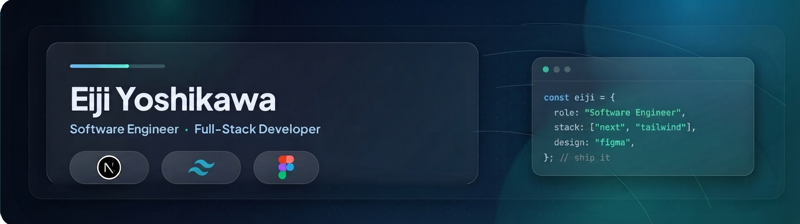

<!-- ╔══════════════════════════════════════════════════════════════╗ -->
<!-- ║                          BANNER                                ║ -->
<!-- ║   (profile-banner.jpg — jangan diubah, ini desain milik kamu)  ║ -->
<!-- ╚══════════════════════════════════════════════════════════════╝ -->

<p align="center">
  
</p>

<!-- ───────────────────────── SUB-HEADLINE ───────────────────────── -->

<!-- ───────────────────────── SOCIAL / CONTACT ───────────────────── -->

<p align="center">
  <!-- Isi URL portfolio & LinkedIn kamu di bawah ini -->
  <a href="https://your-portfolio.com">
    
  </a>
  <a href="mailto:Lochuansen@gmail.com">
    
  </a>
  <a href="https://www.linkedin.com/in/eiji-yoshikawa-998582252?utm_source=share_via&utm_content=profile&utm_medium=member_android">
    
  </a>
</p>

<!-- ╔══════════════════════════════════════════════════════════════╗ -->
<!-- ║                         ABOUT ME                               ║ -->
<!-- ╚══════════════════════════════════════════════════════════════╝ -->

<h3>About Me</h3>

```ts
const eiji = {
  role:      "Software Engineer",
  focus:     ["Full-Stack Web", "SaaS", "Developer Experience"],
  learning:  ["Vue.js", "Postman", "Go"],
  mindset:   "Build software that solves problems and makes work easier.",
};
```

- I build **full-stack web applications** end to end — API, UI, and the glue in between.
- Focused on **reliability, clean architecture, and practical value** over hype.
- Open to collaboration on **SaaS products** and **open-source** tooling.

<!-- ╔══════════════════════════════════════════════════════════════╗ -->
<!-- ║                        TECH STACK                              ║ -->
<!-- ╚══════════════════════════════════════════════════════════════╝ -->

<h3>Tech Stack</h3>

###### Languages
<p>
  
  
  
  
  
</p>

###### Frontend
<p>
  
  
</p>

###### Backend &amp; Database
<p>
  
  
</p>

###### Tools
<p>
  
  
  
  
</p>

<!-- ╔══════════════════════════════════════════════════════════════╗ -->
<!-- ║                     CURRENTLY BUILDING                         ║ -->
<!-- ╚══════════════════════════════════════════════════════════════╝ -->

<h3>Currently Building</h3>

> Building **SaaS products, full-stack applications, and internal tools** with a focus on
> **reliability** and **practical value** — the kind of software that quietly does its job well.

<!-- ╔══════════════════════════════════════════════════════════════╗ -->
<!-- ║                    WHAT I LIKE BUILDING                        ║ -->
<!-- ╚══════════════════════════════════════════════════════════════╝ -->

<h3>What I Like Building</h3>

<p>
  
  
  
  
  
  
</p>

<!-- ╔══════════════════════════════════════════════════════════════╗ -->
<!-- ║                     CURRENTLY LEARNING                         ║ -->
<!-- ╚══════════════════════════════════════════════════════════════╝ -->

<h3>Currently Learning</h3>

<p>
  
  
  
</p>

<!-- ╔══════════════════════════════════════════════════════════════╗ -->
<!-- ║                      GITHUB STATISTICS                         ║ -->
<!-- ╚══════════════════════════════════════════════════════════════╝ -->

<h3>GitHub Statistics</h3>
<p align="center">
  
</p>
<picture data-importer="pacman">
  <source media="(prefers-color-scheme: dark)" srcset="https://raw.githubusercontent.com/Lochuansen7/Lochuansen7/pacman-output/pacman-contribution-graph-dark.svg?game=pacman">
  <source media="(prefers-color-scheme: light)" srcset="https://raw.githubusercontent.com/Lochuansen7/Lochuansen7/pacman-output/pacman-contribution-graph.svg?game=pacman">
  
</picture>